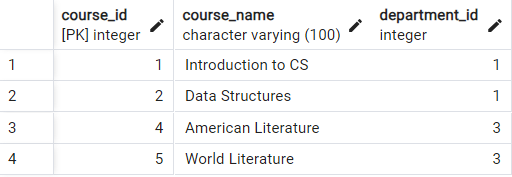

# Introduction

In this exercise, you will learn the fundamentals of setting up and using a **PostgreSQL** database, one of the most popular open-source relational database management systems. You will also be introduced to **pgAdmin**, a web-based administration tool for managing PostgreSQL databases through a graphical user interface (GUI). By the end of the exercise, you will have hands-on experience with:

1. **Installing PostgreSQL** and **pgAdmin** on your system (or using a hosted environment).
2. **Creating** and **connecting** to a PostgreSQL database.
3. **Designing** and **creating** tables using SQL commands.
4. **Inserting** sample data into the tables.
5. **Retrieving** data with basic `SELECT` queries to understand how SQL works.

Understanding these core concepts will provide a strong foundation for more advanced database topics, such as joining multiple tables, indexing, and optimizing queries.

---

## Part 1: Installation and Setup

1. **Install PostgreSQL**

   - Download the latest version of PostgreSQL from the [official website](https://www.postgresql.org/download/), or use your system’s package manager (e.g., Homebrew on macOS, APT on Ubuntu/Debian).
   - When prompted during installation on Windows, ensure the “pgAdmin” component is selected.

2. **Launch pgAdmin**

   - If you installed PostgreSQL with the Windows installer, pgAdmin is included by default.
   - On macOS or Linux, search your applications for “pgAdmin” or run `pgAdmin4` if installed via a package manager.
   - Alternatively, if you prefer the command line, open your terminal and use the `psql` tool to access the PostgreSQL server.

3. **Create a New Database**
   - In pgAdmin, expand the server tree and right-click on **Databases** to create a new database (e.g., `mydb`).
   - If using `psql`, you can run:
     ```sql
     CREATE DATABASE mydb;
     \c mydb  -- to connect to the newly created database
     ```

---

## Part 2: Create the Required Tables

1. **DROP TABLES (to allow repeated testing)**

   ```sql
   DROP TABLE IF EXISTS enrollments;
    DROP TABLE IF EXISTS instructors;
    DROP TABLE IF EXISTS courses;
    DROP TABLE IF EXISTS students;
    DROP TABLE IF EXISTS departments;
   ```

2. **Departments Table**

   ```sql
   CREATE TABLE departments (
    department_id   SERIAL PRIMARY KEY,
    department_name VARCHAR(100) NOT NULL,
    location        VARCHAR(100),
    budget          NUMERIC(12,2)
    );
   ```

3. **Students Table**

   ```sql
   CREATE TABLE students (
    student_id      SERIAL PRIMARY KEY,
    first_name      VARCHAR(50) NOT NULL,
    last_name       VARCHAR(50) NOT NULL,
    email           VARCHAR(100),
    date_of_birth   DATE,
    gender          CHAR(1),
    phone           VARCHAR(20),
    city            VARCHAR(100),
    gpa             NUMERIC(3,2)
    );
   ```

4. **Courses Table**

   ```sql
   CREATE TABLE courses (
    course_id       SERIAL PRIMARY KEY,
    course_name     VARCHAR(100) NOT NULL,
    department_id   INT REFERENCES departments(department_id) ON DELETE SET NULL,
    credits         INT NOT NULL DEFAULT 3,
    start_date      DATE
    );
   ```

5. **Instructors Table**

   ```sql
   CREATE TABLE instructors (
    instructor_id   SERIAL PRIMARY KEY,
    first_name      VARCHAR(50) NOT NULL,
    last_name       VARCHAR(50) NOT NULL,
    department_id   INT REFERENCES departments(department_id) ON DELETE SET NULL,
    hire_date       DATE,
    salary          NUMERIC(10,2)
    );
   ```

6. **Enrollments Table**

   ```sql
   CREATE TABLE enrollments (
    enrollment_id   SERIAL PRIMARY KEY,
    student_id      INT REFERENCES students(student_id) ON DELETE CASCADE,
    course_id       INT REFERENCES courses(course_id) ON DELETE CASCADE,
    grade           CHAR(1),
    enrollment_date DATE
    );
   ```

---

## Part 3: Insert Sample Data

1. **Insert Data into Departments**

   ```sql
   INSERT INTO departments (department_name, location, budget)
    VALUES
    ('Computer Science', 'Building A', 500000.00),
    ('Mathematics', 'Building B', 250000.00),
    ('Literature', 'Building C', 150000.00);
   ```

2. **Insert Data into Students**

   ```sql
   INSERT INTO students (first_name, last_name, email, date_of_birth, gender, phone, city, gpa)
    VALUES
    ('Alice', 'Brown', 'alice.brown@example.com', '2000-01-15', 'F', '555-1010', 'New York', 3.5),
    ('Bob', 'Smith', 'bob.smith@example.com', '1999-05-20', 'M', '555-2020', 'Los Angeles', 3.7),
    ('Charlie', 'Johnson', NULL, '2001-11-02', 'M', NULL, 'New York', 2.9),
    ('Diana', 'Evans', 'diana.evans@example.com', '1998-12-11', 'F', '555-3030', 'Chicago', 3.1),
    ('Ethan', 'Garcia', 'ethan.garcia@example.com', '1997-07-07', 'M', '555-4040', 'Seattle', NULL),
    ('Faith', 'Martinez', 'faith.martinez@example.com', NULL, NULL, NULL, 'Chicago', 3.8),
    ('Gina', 'Hall', 'gina.hall@example.com', '2002-03-22', 'F', '555-5050', 'Los Angeles', 2.6);
   ```

3. **Insert Data into Courses**

   ```sql
   INSERT INTO courses (course_name, department_id, credits, start_date)
    VALUES
    ('Introduction to CS', 1, 4, '2023-09-01'),
    ('Data Structures', 1, 4, '2023-09-01'),
    ('Calculus I', 2, 3, '2023-09-01'),
    ('American Literature', 3, 3, '2023-09-01'),
    ('World Literature', 3, 3, '2024-01-15');
   ```

4. **Insert Data into Instructors**

   ```sql
   INSERT INTO instructors (first_name, last_name, department_id, hire_date, salary)
    VALUES
    ('John', 'Doe', 1, '2020-08-15', 70000.00),
    ('Susan', 'Miller', 2, '2018-03-10', 85000.00),
    ('Karen', 'White', 3, '2021-06-01', 62000.00),
    ('Paul', 'Green', NULL, '2019-01-20', 50000.00);
   ```

5. **Insert Data into Enrollments**

   ```sql
   INSERT INTO enrollments (student_id, course_id, grade, enrollment_date)
    VALUES
    (1, 1, 'A', '2023-09-10'),
    (1, 2, 'B', '2023-09-10'),
    (2, 1, 'B', '2023-09-15'),
    (2, 3, 'A', '2023-09-16'),
    (3, 3, 'C', '2023-09-20'),
    (4, 2, 'B', '2023-09-21'),
    (5, 4, NULL, '2023-09-22'),   -- grade not yet assigned
    (5, 1, 'A', '2023-10-01'),
    (6, 4, 'A', '2023-10-05'),
    (7, 5, 'B', '2024-01-20');
   ```

## **Done. Now you have a small database to practice exercise queries.**

---

## SQL Query Exercises

1.  **BETWEEN: Find the students who were born between January 1, 1999 and December 31, 2000.**

    **Expected Result**
    
    

***

2.  **Retrieve all courses that have a `course_id` between 2 and 4 (inclusive)**

    **Expected Result**
    
    

***

3.  **Display each student’s first name, GPA, and a new column that classifies the student into one of three categories:**

    - `"High"` if GPA >= 3.5
    - `"Medium"` if GPA is between 3.0 and 3.49
    - `"Low"` if GPA < 3.0
    - If GPA is `NULL`, display `"No GPA"`

    **Expected Result**
    
    

***

4.  **For each enrollment, display the `enrollment_id`, `grade`, and a new column named `grade_comment` with the following logic:**

    - If grade is `'A'`, then `"Excellent"`
    - If grade is `'B'`, then `"Good"`
    - If grade is `'C'`, then `"Needs Improvement"`
    - If grade is `NULL` or anything else, then `"Not Assigned/Other"`.

    **Expected Result**
    
    

***

5.  **Find all students who live in either `'New York'`, `'Chicago'`, or `'Seattle'`.**

    **Expected Result**
    
    

***

6.  **Find all students whose email ends with `@example.com`.**

     **Expected Result**
    
     

***

7.  **Find all students whose email ends with `@example.com`.**

     **Expected Result**
    
     

***

8.  **Retrieve all courses whose `course_name` contains the word `"Literature"`.**

    **Expected Result**
    
    

***

9.  **Find all students who do not have a phone number on file (`phone` is `NULL`).**

     **Expected Result**

     

***

10. **Find all enrollments where the grade is NOT assigned (i.e., `NULL`).**

    **Expected Result**
    
    

***

11. **Show the first 3 students (ordered by `student_id` ascending).**

    **Expected Result**
    
    

***

12. **Show the next 2 students (after skipping the first 3), ordered by `student_id`.**

    **Expected Result**
    
    

***

13. **Find all departments whose budget is **above** the **average department budget**.**

    **Expected Result**
    
    

***

14. **List each student’s name and the number of courses they are enrolled in. Use a **subquery** in the `SELECT` clause to count enrollments.**

    **Expected Result**
    
    

***

15. **Display each instructor’s name, salary, and a **running total** of salaries ordered by `hire_date`.**

    **Expected Result**
    
    

***

16. **For each student, show the order of their enrollments (based on `enrollment_date`) along with a **cumulative count** of their enrollments.**

    **Expected Result**
    
    

***

17. **For each department, find the **maximum** of the **average GPA** of students who are enrolled in that department’s courses. (This is slightly advanced—requires grouping by department, then calculating average GPAs by course, then finding the max.)**

    **Hint:** You could do this with multiple GROUP BY levels or a subquery approach. One approach is:

    1. First, get each course’s average GPA (i.e., join enrollments to students).
    2. Then group those results by department and find the max.

    **Expected Result**
    
    

***

18. **Calculate the **sum** of the **average credits** offered per department. In other words, for each department, you find the average number of credits of its courses, and then sum those averages across all departments.**

    **Expected Result**
    
    

***

19. **Retrieve all courses whose `credits` are **greater** than **ANY** of the credits in the Mathematics (dept_id = 2) courses.**

    **Expected Result**
    
    

***

20. **Retrieve all students whose GPA is **greater** than **ALL** the GPAs of students living in `'Los Angeles'`**

    **Expected Result**
    
    
